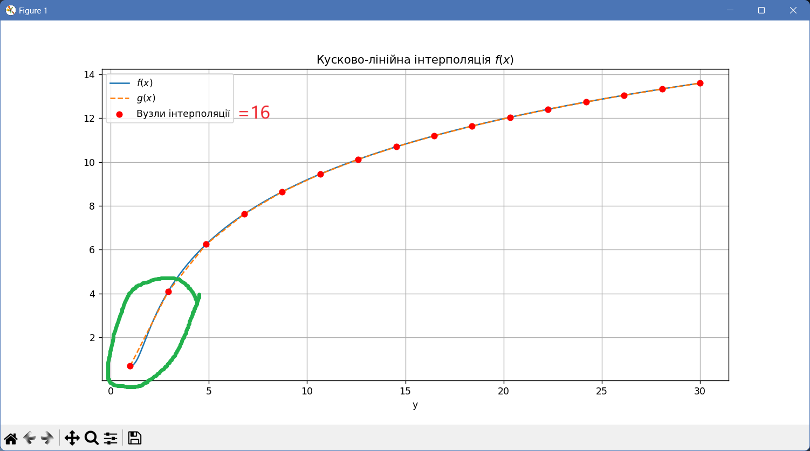
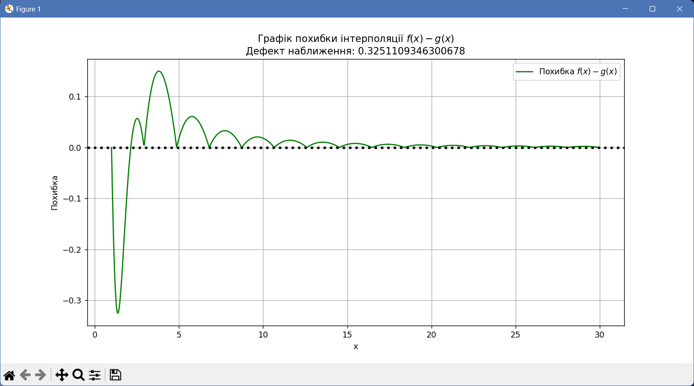

## Закономірності для $f(x) = \ln{(x^4 - 2x^2 + 3)},\ x \in [1, 30]$

| $n$ | $\Delta_n$ | $\Delta_1$ |
| --- | --- | --- |
| 4 | 1.0450988769620757 | 2.0576180242529145 |
| 8 | 0.4927310484438647 | 0.7078246499927618 |
| 12 | 0.4900734474122539 | 0.2830812607025599 |
| 16 | 0.35923285827649387 | 0.3251109346300678 |
| 20 | 0.2116643205868045 | 0.33919184842166294 |

$\Delta_n$ зменшується зі збільшенням $n$, таким чином поліном краще апроксимує $f(x)$ на заданому проміжку. Але зменшення похибки не завжди є монотонним: для $n=8$ та $n=12$ похибка є майже однаковою ($0.4927$ і $0.49$)

$\Delta_1$ зменшується при $n \in [4; 12]$, але потім починає зростати. Це трапляється через те, що на першому інтервалі $g(x)$ йде крізь $f(x)$, утворюючи від'ємне значення похибки. Але оскільки береться абсолютне значення, знак мінуса опускається і похибка записується як найбільша на інтервалі:

- Видно, як $g(x)$ перетинає $f(x)$ на першому інтервалі, що утворює велику похибку

- Видно великий пік у похибці на початку інтервалу, який зумовлює збільшення $\Delta_1$

